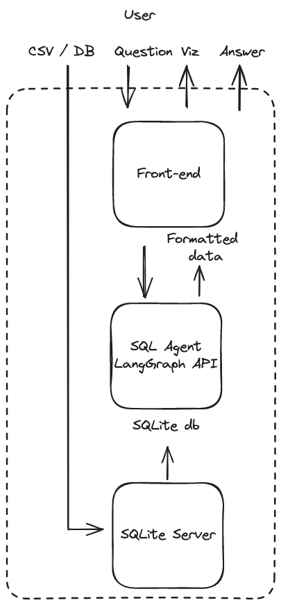
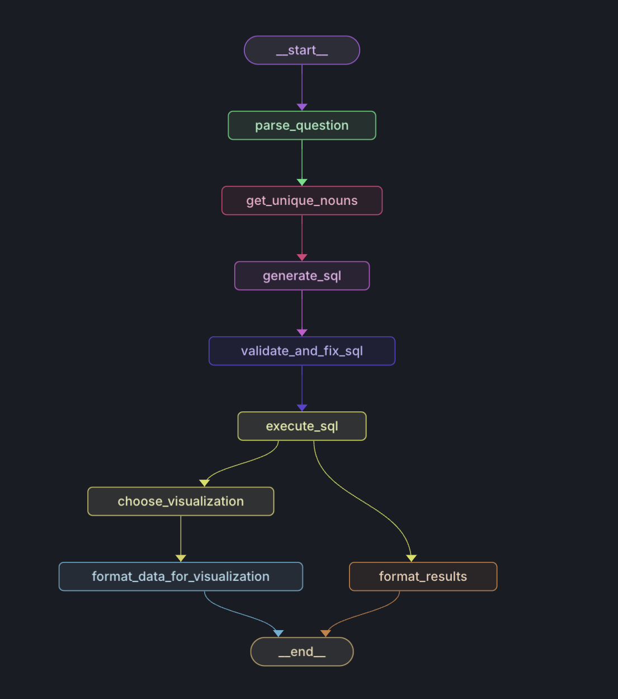
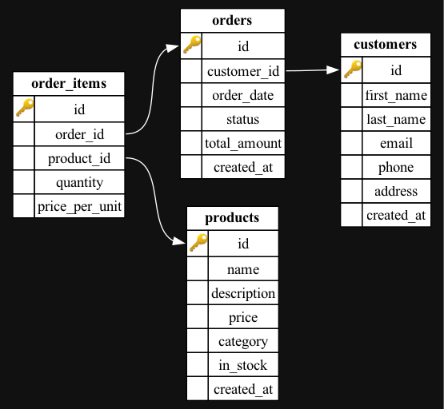

# SQL Query Visualization Project

This agent bridges the gap between natural language questions and data visualization, allowing users to questions about a dataset and receive insightful visual representations in response. Users can upload a SQLite database or CSV file and ask questions about the data in natural language. The agent generates a SQL query based on the user's question, executes it on the database, and formats the results into a visual representation.


## Overall Architecture

The workflow is orchestrated using `LangGraph`, which provides a framework for easily building complex AI agents, a streaming API for real-time updates, and a visual studio for monitoring and experimenting with the agent's behavior. Around the LangGraph agent, the workflow uses a  front-end that has prebuilt graph templates for visualization of data from LangGraph's streaming API. Once the visualization is generated, the user can also see the traces of the workflow provided by LangGraph to inspect the internal state of the agent.



## Agent Architecture

The LangGraph agent is made up of several nodes, visualized in the diagram and explained below. See more details in the blog post [here](https://pear-catboat-4f2.notion.site/Building-a-Data-Visualization-Agent-with-LangGraph-Cloud-3cd220670e40419d9f5cf961eb160514).



#### Parse Question

This node perform query analysis, examining the user question jointly with the database schema to determine if the question is relevant to the database. If relevant, it identifies which tables and columns are needed to answer the question. 

#### Get Unique Nouns

This node focuses on the "noun columns" for each table, which contain non-numeric values. It produces a set of sample values from these columns, which are helps in generating more precise SQL queries by knowing specific values in the database. As explained the blog post [here](https://pear-catboat-4f2.notion.site/Building-a-Data-Visualization-Agent-with-LangGraph-Cloud-3cd220670e40419d9f5cf961eb160514), this can be useful for cases of ambiguous spelling (e.g., a user may ask about the band "ac dc", but the database may contain the name "AC/DC") of entities in the database.

#### Generate SQL

This node generate an SQL query based upon the user's original question, the relevant tables and columns identified earlier, the sampled data (unique nouns) extracted from the database in the above step.

#### Validate and Fix SQL

This node validates the query, ensuring that the SQL query is valid and if all table and column names are correctly spelled and exist in the schema.

#### Execute SQL

This node runs the validated SQL query against the database. 

#### Choose Visualization

This node uses an LLM to choose an appropriate visualization for the data, selecting one of several visualizations (bar, horizontal bar, scatter, pie, line) to use. 

#### Format Results

This node uses an LLM to format the query results into a human-readable / natural language response and runs in parallel with the Format Data for Visualization node.

#### Format Data for Visualization

This node formats the data for the chosen visualization type, which is then used to generate the visualization on the frontend.

## Getting Started

### Setup

#### Backend

You can use `backend_js` or `backend_py` as your backend. If using python, for example, the LangGraph agent is defined in `backend_py/my_agent`. This defines the logic within each node of the SQL agent, following the steps explained above. The [LangGraph API](https://github.com/langchain-ai/langgraph-api) can be used to wrap this code, providing a back-end to our application. 

1. **Create a `.env` file** 

If using python backend. When we load the project into LangGraph Studio, Studio will package our code with the LangGraph API and run it in a containerized Docker environment that needs access to certain environment variables provided by the `.env` file. 
```
$ echo "OPENAI_API_KEY=your_actual_openai_api_key_here
LANGSMITH_API_KEY=your_actual_langsmith_api_key_here
DB_NAME=ecommerce.sqlite" > backend_py/.env
```

2. **Install dependencies**

```
cd backend_py
pip3 install -r requirements.txt
```

3. **Start Studio** 

If using python locally, for example, open the `backend_py` folder in your terminal and execute

```
langgraph dev
```

### Create SQLite database

You can use any SQLlite database. This project comes with a sample script that can create one for you:

```sh
db_creation/create-database
```

This should create a file called `ecommerce.sqlite` in the `data` directory. Here's a diagram of the database schema:



#### Frontend

1. **Create a `.env` file** 

You can use `frontend/.env.example` as a template. Here, `LANGGRAPH_API_URL` is the URL you will find in the LangGraph Studio UI, as mentioned above, which gives the frontend access to the LangGraph API.

```
$ echo "NEXT_PUBLIC_SQLITE_URL=http://localhost:3001
LANGGRAPH_API_URL=xxx" > frontend/.env
```

2. **Start the frontend** 
```
$ yarn install
$ yarn dev
````

Now, the frontend is running at `http://localhost:3000`. By default, you can use [this sample dataset](https://docs.google.com/spreadsheets/d/1S2mYAKwYYmjZW6jURiAfMWTVmwg74QQDfwdMUvVEgMk/edit?gid=1749607041#gid=1749607041) in the UI.

## Usage

### Using the Frontend

1. Navigate to the frontend URL (`http://localhost:3000` by default)
2. Enter a natural language query
3. View the stream of the graph state and then the generated visualization
4. Optionally, view the query execution traces


## Contributing

Contributions are welcome! Please feel free to submit a Pull Request.
